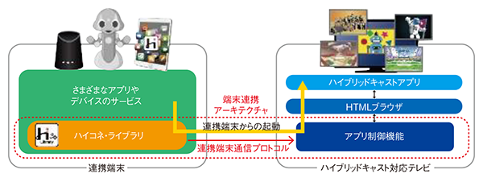

# hyconet.js

Hybridcast-Connect Reference SDK for javascript | ハイコネリファレンスSDKのJavascript実装


## Overview

"hyconet.js" is the javascript based reference implementation SDK of the "Hybridcast-Connect" that was standardized at Sep.2018 in IPTV Forum Japan. Hybridcast-Connect can realize to control some parts of the functions of a tuner on a TV Set from a application outside of the tuner , and communicate with text message between the TV Set and some applications.

The OSS, "hyconet.js" is utilized as a part of Node-RED module in the NHK Demo Application of [W3C TPAC2019 WoTIG/WG](https://www.w3.org/WoT/IG/wiki/F2F_meeting,_16-20_September_2019,_Fukuoka,_Japan#Agenda).
The Node-RED plugin is here. [node-red-contrib-hyconet](https://github.com/nhkrd/node-red-contrib-hyconet).

(see [W3C WoTIG/WG Plugfest](https://w3c.github.io/tpac-breakouts/sessions.html#wot-pf) and  [WoT Media Usecase](https://github.com/w3c/wot-usecases/blob/master/USE-CASES/nhk-device-tv-sync.md)).


For more detail of Hybridcast-Connect, see [Hybridcast-Connect instruction](./HybridcastConnect.md). For use of "hyconet.js", see [LICENSE](./LICENSE.txt) and [NOTICE](./NOTICE.txt).


hyconet.jsは、2018年9月にIPTV Forum Japanで標準規格化された「ハイブリッドキャストコネクト」(以後、ハイコネ)のプロトコルを使うためのリファレンスSDK（ハイコネライブラリのjavascript実装）です.ハイコネを利用すると、ハイブリッドキャスト対応テレビ（受信機）の一部の機能を、連携端末のアプリケーションから制御でき、その受信機および受信機上のHybridcastサービスのブラウザアプリケーションと通信もできます.本SDKはハイコネのプロトコルテストで利用されているツールの一部をOSS化したものです.

hyconet.jsは、[W3C TPAC2019 WoTIG/WG](https://www.w3.org/WoT/IG/wiki/F2F_meeting,_16-20_September_2019,_Fukuoka,_Japan#Agenda)において、node-redプラグインを併用したアプリケーションによって、ハイブリッドキャスト対応受信機とIoTデバイスの連携のユースケースデモにて利用されています.([W3C WoTIG/WG Plugfest](https://w3c.github.io/tpac-breakouts/sessions.html#wot-pf) and  [WoT Media Usecase](https://github.com/w3c/wot-usecases/blob/master/USE-CASES/nhk-device-tv-sync.md)).


ハイブリッドキャストコネクトの詳細は、[About "Hybridcast-Connect"](./HybridcastConnect.md)を参照ください.本ソフトウェアの利用に関しては、LICENSEおよびNOTICEファイルを参照ください.



- Reference
    - ["Hybridcast-Connect" Overview](./HybridcastConnect.md)
    - [IPTVFJ STD-0013 "ハイブリッドキャスト運用規定(Hybridcast Operational Guideline)"](https://www.iptvforum.jp/download/input.html)
    - [W3C TPAC2018 Media&Entertainment IG "RecentAchievementOfHybridcast in TPAC2018"](https://www.w3.org/2011/webtv/wiki/images/4/45/RecentAchievementHybridcast_TPAC20181022.pdf)
    - [W3C TPAC2019 Media&Entertainment IG "RecentAchievementOfHybridcast in TPAC2019"](https://www.w3.org/2011/webtv/wiki/images/d/d1/MediaTimedEventsInHybridcast_TPAC20190916.pdf).


## Environment

- nodejs: v10.x+

## Install

### npm package from github

github経由でのインストール

```
npm install git+https://github.com/nhkrd/hyconet.js.git
```

### Local install

```bash
$ git clone https://github.com/nhkrd/hyconet.js.git
$ mkdir -p testapp
$ cd testapp
$ npm init
$ npm install ../hyconet.js
```

## Dependencies

see "package.json"

```
"node-ssdp": "^4.0.0",
"request": "^2.88.0",
"request-promise": "^4.2.4",
"websocket": "^1.0.29",
"xmljson": "^0.2.0
```

## Limitation of Use (System Limitation) 

In the device search process, a application with this hyconet.js library can receive UDP Multicast Datagram packets.If your environment is docker on Mac, a application in docker can not receive the UDP packets because of system limitation. 

デバイスsearchにはSSDPを使用するため、UDP Multicast送信後のUDPパケット受信＆ハンドリングできる環境が必要.特にdockerを使った場合、Linux環境以外はUDP Multicastパケットの受信ができない.


## API

APIで実現する機能の詳細については、IPTVFJ STD-0013-7章/8章を参照

### search

```nodejs
() -> Promise(resolve(DEVICELIST), reject)
```

- DEVICEINFO object

以下の情報を保持するJSONオブジェクト

  - ipaddr: 発見した受信機のIPアドレス
  - profile: プロトコル
  - friendlyName: 受信機のモデルなどの呼び名
  - ApplicationURL: ハイコネプロトコルのAPI情報を取得するためのベースURL
  - uuid: 受信機のuuid
  - LocationURL: deviceSearch時にdeviceの基本情報を取得するためのURL
  - deviceType: 対応するプロトコル情報
  - manufacture: デバイスメーカー

```
{
    ipaddr: String,
    profile: String,
    friendlyName: String,
    ApplicationURL: String,
    uuid: String,
    LocationURL: String
}
```

- DEVICELIST Object

DEVICEINFOオブジェクトのarray

```
[
  DEVICEINFO, DEVICEINFO, ....
]
```
### getDeviceList

### getDeviceListInfo

Return indexed list of devices found in search process.

```
[ 
  { deviceProfile: 'HCXPGeneric',
    ipaddr: '192.168.0.111',
    manufacturer: 'Amazon',
    modelName: 'AFTM',
    friendlyName: 'Fire TV stick',
    devType: 'DIAL/HCC(Antwapp)/2.0' },
  { deviceProfile: 'HCXPGeneric',
    ipaddr: '192.168.0.112',
    manufacturer: 'Amazon',
    modelName: 'AFTTM',
    friendlyName: 'Fire TV stick',
    devType: 'DIAL/HCC(Antwapp)/2.0' } ]
```

### select

```nodejs
({ index: Number }) -> Promise(resolve(DEVICEINFO), reject)
```

### directselect

Specify deviceinfo object below to select target device.

```nodejs
({
    ipaddr: String, // required
    proile: String,
    friendlyName: String,
    ApplicationURL: String,  // required
    uuid: String,
    LocationURL: String
}) -> Promise( resolve(DEVICEINFO), reject)
```


### getMedia

```
() -> Promise(resolve(STATUS), reject)
```


### getChannels

```
() -> Promise(resolve(STATUS), reject)
```


### getReceiverStatus

```
() -> Promise(resolve(STATUS), reject)
```

### startAITControlledApp

- 選局または選局->Hybridcastアプリ起動のAPI

```
(
  {
    mode:"app",
    app: {
      resource: { original_network_id: 32737, transport_stream_id: 32737, service_id: 1032 },
      hybridcast: { aiturl: "http://172.16.11.91/hybridcast/hc/nhk.ait", orgid: 1, appid: 1 }
    }
  }
) -> Promise(resolve(STATUS), reject)
```

- mode
  - mode="tune" : only tune
  - mode="app" : launch hybridcast html app after tune 
- appObject
  - resource : channels information to tune (you can get from channelsInfoAPI)
  - hybridcast: hybridcast resource information to launch (you need know hybridcast launching process, see hybridcast standardization documents)


### setWebsocketListener

websocket通信におけるメッセージ受信処理を実装するためのAPI.Websocket接続時にCallbackFunctionがセットされる.

```
( WebsocketMessageReceiverCallbackFunction, SetURLMessageCallbackFunction) -> None
```

- WebsocketMessageReceiverCallbackFunction
  websocket通信で受信した全てのテキストメッセージを補足するCallbackFunction

- SetURLMessageCallbackFunction
  websocket通信の中におけるsetURLフォーマットのデータを受信した時に発動するCallbackFunction


### connWebsocket

websocket通信開始API.接続時にwebsocketメッセージ受信のためのsetWebsocketListenerで指定したcallbackが設定される.

```
() -> Promise(resolve(STATUS), reject)
```


### sendWebsocket

websocket接続後にTV受信機へメッセージを送信するためのAPI

```
({
  msg: {
    devid: String,
    sendTextToHostDevice: {
      text: String
    }
}) -> Promise
```

### sendTextOverWebsocket

websocket接続後にHybridcastアプリへメッセージ送信するためのAPI

```
( String ) -> Promise
```

### add/removeWSListener

TBD

### requestURLOverWebsocket

TV受信機がHybridcastブラウザから設定されたsetURLとその付随情報を取得するためのAPI

```
() -> Promise
```

### Example

"hyconet.js" can be ran as commandline in node.js REPL enviroment.
This Example is the same as the file "[samples/hyconet-sample.js](./samples/hyconet-sample.js)". 
Please Refer samples/hyconet-sample.js.

```javascript
// Available to run in node.js commandline(REPL)

const hyconet = require("hyconet.js")

hyconet.search().then(function(data) {
  console.log(data);
  console.log("searchTestEnd");
})

const devinfo1 = {
    index: 3,
    ipaddr: "192.168.0.111"
}

const selectPromise = hyconet.select(devoinfo1)
selectPromise.then(function(data) {
  console.log(data)
  console.log("selectTestEnd");
})


hyconet.select( { index: 2, ipaddr: "192.168.0.111" })

		const deviceinfo2 = {
			ipaddr:"192.168.0.111",
			profile:"HCXPGeneric",
			friendlyName:"AFTM",
			ApplicationURL: "http://192.168.0.111:8887/apps/",
			uuid: "annn-ttt--www-bbbb",
			LocationURL: "http://192.168.0.111:60000/upnp/dev/ac1eb2b3-9888-3f93-b11c-9d9fe91587d8/desc"
		}

hyconet.directselect(deviceinfo2)
    .then(function(data) {
  console.log(data)
  console.log("dselTestEnd");
})

// getmedia
hyconet.getmedia().then( d => console.log(d))

// channels
hyconet.getchannels({media:"TD"}).then( d => console.log(d))

// getstatus
hyconet.getReceiverStatus().then(d => console.log(d))

//startAIT
hyconet.startAITControlledApp(
  {
    mode:"tune",
    app: {
      resource: {original_network_id: 4, transport_stream_id: 16625, service_id: 101},
      hybridcast: {aiturl:"http://example.com/ait.ait",orgid:16,appid:1}
    }
  }).then(d => console.log(d))


hyconet.startAITControlledApp(
  {
    mode:"app",
    app: {
      resource: {original_network_id: 4, transport_stream_id: 16433, service_id: 103},
      hybridcast: {aiturl:"http://example.com/ait.ait",orgid:16,appid:1}
    }
  }).then(d => console.log(d))

// Websocket Communication API
// websocket setListener(wsmsgReceiver , seturlReceiver)
hyconet.setWebsocketListener(
    function(d){console.log(d);console.log("wsMsg Received")},
    function(e){console.log(e);console.log("seturl Received")}
)

// connetcWebsocketSession
hyconet.connWebsocket().then(d => console.log(d))

// sendtext over Websocket
hyconet.sendTextOverWebsocket("テキスト送信メッセージ").then(d => console.log(d))

// requestURL
hyconet.requestUrlOverWebsocket()
```

# License

See [LICENSE.txt](./LICENSE.txt).

本ソフトウェアのライセンスについては[LICENSE.txt](./LICENSE.txt)を参照.